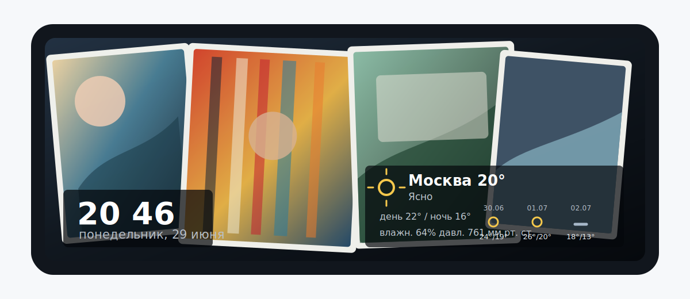
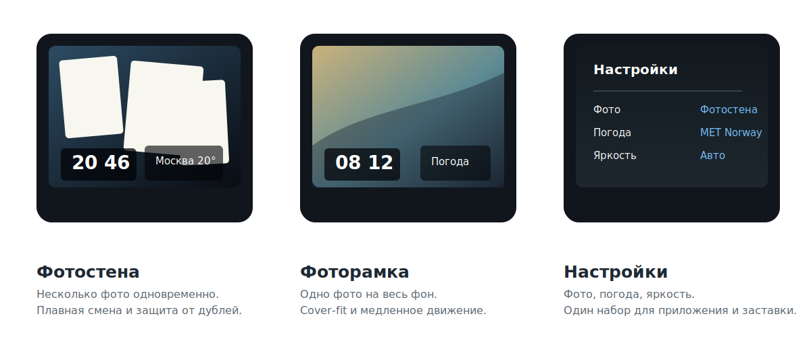

# WClock

**Русский** | [English](#english)

WClock — Android-приложение для настольных часов, фотозаставки и погодного экрана. Оно рассчитано на планшет, телефон или Android TV-приставку, которые постоянно стоят на столе, полке или тумбе: показывает крупное время, локальные фотографии, текущую погоду и прогноз без Google Play Services, аккаунтов, облачной синхронизации и аналитики.

Приложение можно использовать как обычный полноэкранный экран часов или как системную заставку Android Daydream/screensaver.



## Текущий релиз

- Последний релиз: `v0.1.6`.
- APK: [WClock-v0.1.6.apk](https://github.com/sstpnk/apk-wclock/releases/download/v0.1.6/WClock-v0.1.6.apk).
- AAB: [WClock-v0.1.6.aab](https://github.com/sstpnk/apk-wclock/releases/download/v0.1.6/WClock-v0.1.6.aab).
- Минимальная версия Android: 4.4 KitKat (`minSdk 19`).
- `versionName`: `0.1.6`.
- `versionCode`: `7`.

## Зачем нужен WClock

WClock превращает старый или свободный Android-планшет в постоянный домашний экран:

- настольные или настенные часы для дома, офиса, кухни, мастерской или стойки ресепшена;
- фоторамка с локальными семейными, рабочими или демонстрационными фотографиями;
- погодный экран с текущими условиями и прогнозом;
- системная заставка Android для устройств, которые большую часть времени подключены к питанию.

Фотографии читаются только из выбранной локальной папки. Погода загружается напрямую от выбранного погодного источника. Для базовой работы не нужны Google Play Services, сторонние аккаунты, платная подписка или внешний сервер.



## Основные возможности

### Часы

- Крупное отображение времени и даты.
- Опциональное отображение секунд.
- Полноэкранный режим без системных панелей.
- Полупрозрачные подложки для читаемости поверх фотографий.
- Небольшой периодический сдвиг подложек для снижения риска выгорания экрана.
- Работа как обычное приложение или как Android Daydream/screensaver.

### Фотографии

- Выбор локальной папки с изображениями.
- Поддержка Storage Access Framework на Android 5+.
- Fallback-файловый браузер для Android 4.4.
- Корректная обработка EXIF-ориентации фотографий.
- Ограничение декодируемого размера изображений для снижения расхода памяти.
- Предзагрузка фотографий вне основного кадра, чтобы уменьшить рывки и мерцание.

### Режим фотостены

- Несколько фотографий одновременно.
- Плавное появление и исчезновение карточек.
- Легкий поворот карточек.
- Рамка вокруг фотографии.
- Случайный или последовательный порядок.
- Защита от одновременного показа одной и той же фотографии, если в папке достаточно изображений.

### Режим фоторамки

- Одна фотография на весь фон.
- Cover-fit масштабирование.
- Медленное панорамирование крупных изображений перед переключением.
- Плавный переход между кадрами.

### Погода

- Текущая температура.
- Описание погодных условий.
- Влажность и давление.
- Прогноз на несколько дней.
- Контурные или цветные погодные иконки.
- Fallback между провайдерами при ошибке.
- Диагностика последней попытки загрузки в настройках.
- HTTPS-запросы без глобального разрешения cleartext-трафика.
- Legacy TLS-поддержка для Android 4.4, чтобы современные погодные API работали на старом системном сетевом стеке.

Поддерживаемые источники погоды:

- Open-Meteo, без API-ключа;
- MET Norway, без API-ключа;
- wttr.in, без API-ключа;
- WeatherAPI.com, нужен API-ключ;
- OpenWeather, нужен API-ключ.

### Яркость

- Управление яркостью по датчику освещенности.
- Резервный режим по расписанию: день, вечер, ночь.
- Отдельные настройки минимальной и максимальной автояркости.
- Применение яркости в полноэкранном режиме и в режиме заставки.

## Установка

1. Скачайте APK из последнего [GitHub Release](https://github.com/sstpnk/apk-wclock/releases).
2. Установите APK на устройство Android.
3. Разрешите установку из выбранного источника, если Android попросит это сделать.
4. Откройте WClock.
5. В настройках выберите папку с фотографиями.
6. Укажите город/координаты для погоды.
7. При необходимости включите WClock как системную заставку Android Daydream/screensaver.

Для Android 4.4 используется встроенный fallback-выбор папки, потому что Storage Access Framework доступен не на всех старых устройствах одинаково.

## Настройка приложения

### Фото

Откройте настройки WClock и выберите папку с изображениями. На Android 5+ используется системный выбор папки, на Android 4.4 — встроенный файловый браузер.

Рекомендуемые настройки для фотостены:

- `Режим`: `Фотостена`;
- `Порядок`: `Случайно`, если фотографий много;
- `Количество фото`: 12–20 для планшета 8–10 дюймов;
- `Интервал смены`: 15–30 секунд.

Рекомендуемые настройки для фоторамки:

- `Режим`: `Фоторамка`;
- `Порядок`: `Случайно` для семейного фотоальбома или `Последовательно` для подготовленной папки;
- `Интервал смены`: 20–60 секунд;
- `Скорость панорамы`: 12–24 px/с для плавного движения.

В random-режиме WClock старается не показывать одну и ту же фотографию одновременно в нескольких карточках. Повтор допускается только если в папке недостаточно изображений для заполнения экрана.

### Погода

Укажите название города, широту и долготу. Название города отображается на экране, координаты используются для запроса прогноза.

Рекомендуемый источник для старых устройств:

- `Open-Meteo` — основной вариант без API-ключа;
- `MET Norway` — надежный fallback без API-ключа с дополнительной legacy TLS-поддержкой.

Дополнительные источники:

- `wttr.in` — fallback без API-ключа;
- `WeatherAPI.com` — нужен API-ключ;
- `OpenWeather` — нужен API-ключ.

Если выбранный источник не отвечает, приложение пробует fallback-источники. В настройках показывается строка `Последняя попытка`, где видны результаты последнего запроса по провайдерам.

### Яркость

Если включена автояркость, приложение использует датчик освещенности. Это удобно для планшета, который стоит в комнате весь день: экран становится ярче днем и темнее ночью.

Если датчика нет или автояркость выключена, используется расписание:

- `День` — яркость для дневного времени;
- `Вечер` — промежуточная яркость;
- `Ночь` — минимальная яркость для темной комнаты.

Значения задаются как доля от системной яркости окна: `0.12` означает очень тусклый экран, `0.85` — яркий дневной режим.

### Часы и заставка

WClock можно оставить открытым как обычное приложение или выбрать как системную заставку Android Daydream. В режиме заставки используются те же настройки фото, погоды и яркости.

Для снижения риска выгорания WClock слегка сдвигает подложки часов и погоды. Блоки остаются в нижней части экрана и сохраняют общий нижний край.

## Справочник настроек

| Раздел | Настройка | Что делает |
| --- | --- | --- |
| Экран | Показывать секунды | Добавляет секунды к часам. |
| Фото | Папка фотографий | Источник локальных изображений для фотостены или фоторамки. |
| Фото | Режим отображения | `Фотостена` показывает несколько фото; `Фоторамка` показывает одно фото на весь фон. |
| Фото | Порядок | `Случайно` перемешивает фото; `Последовательно` идет по папке по порядку. |
| Фото | Максимум фото | Ограничивает количество одновременно видимых карточек в фотостене. |
| Фото | Интервал смены | Задает частоту появления новых фото. |
| Фото | Скорость панорамы | Управляет скоростью движения в режиме фоторамки. |
| Место | Город | Подпись в погодном блоке. |
| Место | Широта и долгота | Координаты для погодных API. |
| Погода | Источник | Основной провайдер погоды. |
| Погода | Частота обновления | Интервал между сетевыми запросами. |
| Погода | API-ключи | Используются только для WeatherAPI.com и OpenWeather. |
| Погода | Стиль иконок | Переключает контурные и цветные погодные иконки. |
| Яркость | Автояркость | Включает управление яркостью по датчику освещенности. |
| Яркость | Диапазон автояркости | Минимальная и максимальная яркость для датчика освещенности. |
| Яркость | Расписание | Резервные уровни яркости для дня, вечера и ночи. |

## Приватность и безопасность

- Нет аналитики.
- Нет рекламных SDK.
- Нет Google Play Services dependency.
- Нет облачной синхронизации.
- Фотографии читаются локально из выбранной пользователем папки.
- API-ключи погоды хранятся локально в настройках приложения.
- Погодные запросы выполняются напрямую к выбранным провайдерам.
- Глобальный cleartext-трафик отключен; погодные fallback-запросы используют HTTPS.
- Release signing credentials и keystore не входят в git-репозиторий.

## Права

Приложение запрашивает только права, нужные для своей работы:

- `INTERNET` — загрузка погоды;
- `ACCESS_NETWORK_STATE` — проверка сети;
- `READ_EXTERNAL_STORAGE` или `READ_MEDIA_IMAGES` — чтение выбранных локальных фотографий;
- `BIND_DREAM_SERVICE` — регистрация системной заставки.

## Сборка из исходников

Требования:

- JDK, совместимый с Android Gradle Plugin проекта;
- Android SDK с `compileSdk 35`;
- Gradle wrapper из репозитория.

Команды:

```powershell
.\gradlew.bat testDebugUnitTest assembleDebug assembleRelease bundleRelease
```

Release signing читается из локального `release-signing.properties` или переменных окружения `W_CLOCK_*`. Файл signing properties и keystore намеренно исключены из git.

## Известные ограничения

- Интерфейс настроек функциональный, но пока без отдельного дизайн-фреймворка.
- Качество погодных данных зависит от выбранного провайдера и доступности его API.
- На очень старых устройствах скорость декодирования больших фотографий зависит от памяти и производительности SoC.
- Приложение распространяется как APK/AAB через GitHub Releases, не через Google Play.

## Лицензия

WClock распространяется по лицензии [MIT](LICENSE).

---

# English

[Русский](#wclock) | **English**

WClock is an Android desktop clock, photo screensaver and weather display app. It is designed for a tablet, phone or Android TV device that stays on a desk, shelf or nightstand: it shows large time, local photos, current weather and forecast without Google Play Services, user accounts, cloud sync or analytics.

The app can run as a regular fullscreen clock or as an Android Daydream/screensaver service.


## Current Release

- Latest release: `v0.1.6`.
- APK: [WClock-v0.1.6.apk](https://github.com/sstpnk/apk-wclock/releases/download/v0.1.6/WClock-v0.1.6.apk).
- AAB: [WClock-v0.1.6.aab](https://github.com/sstpnk/apk-wclock/releases/download/v0.1.6/WClock-v0.1.6.aab).
- Minimum Android version: 4.4 KitKat (`minSdk 19`).
- `versionName`: `0.1.6`.
- `versionCode`: `7`.

## What WClock Is For

WClock turns an old or spare Android device into a persistent home display:

- desk or wall clock for home, office, kitchen, workshop or reception desk;
- photo frame for local family, office or demo photos;
- weather screen with current conditions and forecast;
- Android screensaver for devices that stay plugged in most of the time.

Photos are read only from the selected local folder. Weather is fetched directly from the selected weather provider. Basic usage does not require Google Play Services, third-party accounts, paid subscriptions or an external server.


## Features

### Clock

- Large time and date display.
- Optional seconds.
- Fullscreen mode without system bars.
- Translucent panels for readability over photos.
- Small periodic panel shifts to reduce burn-in risk.
- Works as a regular app or Android Daydream/screensaver.

### Photos

- Local image folder selection.
- Storage Access Framework support on Android 5+.
- Built-in fallback file browser for Android 4.4.
- Correct EXIF orientation handling.
- Decode-size limits to reduce memory pressure.
- Off-frame photo preloading to reduce stutter and flicker.

### Photo Wall Mode

- Multiple photos visible at the same time.
- Smooth card entry and fade-out.
- Light card rotation.
- Photo borders.
- Random or sequential order.
- Avoids showing the same photo in multiple cards when enough photos are available.

### Photo Frame Mode

- One fullscreen background photo.
- Cover-fit scaling.
- Slow pan over oversized images before switching.
- Smooth transition between photos.

### Weather

- Current temperature.
- Weather condition description.
- Humidity and pressure.
- Multi-day forecast.
- Outline or colored weather icons.
- Provider fallback on failure.
- Diagnostics for the last weather refresh attempt in settings.
- HTTPS requests without globally allowing cleartext traffic.
- Legacy TLS support for Android 4.4 so modern weather APIs can still work on the old system network stack.

Supported weather providers:

- Open-Meteo, no API key required;
- MET Norway, no API key required;
- wttr.in, no API key required;
- WeatherAPI.com, API key required;
- OpenWeather, API key required.

### Brightness

- Ambient-light-sensor brightness control.
- Day/evening/night fallback schedule.
- Separate minimum and maximum auto-brightness settings.
- Brightness control in fullscreen app mode and screensaver mode.

## Installation

1. Download the APK from the latest [GitHub Release](https://github.com/sstpnk/apk-wclock/releases).
2. Install the APK on your Android device.
3. Allow installation from the selected source if Android asks for it.
4. Open WClock.
5. Select the photo folder in settings.
6. Configure city/coordinates for weather.
7. Optionally select WClock as the Android Daydream/screensaver.

Android 4.4 uses the built-in fallback folder picker because Storage Access Framework behavior is inconsistent on older devices.

## Configuration

### Photos

Open WClock settings and select a folder with images. Android 5+ uses the system folder picker, Android 4.4 uses the built-in file browser.

Recommended photo wall settings:

- `Mode`: `Photo wall`;
- `Order`: `Random`, when the folder contains many photos;
- `Photo count`: 12–20 for an 8–10 inch tablet;
- `Change interval`: 15–30 seconds.

Recommended photo frame settings:

- `Mode`: `Photo frame`;
- `Order`: `Random` for a family album or `Sequential` for a prepared folder;
- `Change interval`: 20–60 seconds;
- `Pan speed`: 12–24 px/s for smooth motion.

In random mode, WClock tries not to show the same photo in multiple cards at the same time. Repeats are allowed only when the folder does not contain enough images to fill the screen.

### Weather

Enter a city name, latitude and longitude. The city name is displayed on the screen, while coordinates are used for forecast requests.

Recommended providers for old devices:

- `Open-Meteo` — primary no-key option;
- `MET Norway` — reliable no-key fallback with additional legacy TLS support.

Additional providers:

- `wttr.in` — no-key fallback;
- `WeatherAPI.com` — API key required;
- `OpenWeather` — API key required.

If the selected provider does not respond, the app tries fallback providers. Settings show the `Last attempt` line with per-provider results from the last request.

### Brightness

When auto-brightness is enabled, WClock uses the ambient light sensor. This is useful for a tablet that stays in a room all day: the display becomes brighter during the day and dimmer at night.

If there is no sensor or auto-brightness is disabled, WClock uses a schedule:

- `Day` — brightness for daytime;
- `Evening` — intermediate brightness;
- `Night` — minimum brightness for a dark room.

Values are fractions of the Android window brightness: `0.12` means a very dim display, `0.85` means a bright daytime mode.

### Clock and Screensaver

WClock can remain open as a regular app or be selected as the Android Daydream screensaver. Screensaver mode uses the same photo, weather and brightness settings.

To reduce burn-in risk, WClock slightly shifts the clock and weather panels over time. Panels remain near the bottom of the screen and keep their shared lower edge.

## Settings Reference

| Section | Setting | Purpose |
| --- | --- | --- |
| Screen | Show seconds | Adds seconds to the clock. |
| Photos | Photo folder | Local image source for photo wall or photo frame. |
| Photos | Display mode | `Photo wall` shows multiple photos; `Photo frame` shows one fullscreen photo. |
| Photos | Order | `Random` shuffles photos; `Sequential` follows folder order. |
| Photos | Max photos | Limits the number of simultaneously visible cards in photo wall mode. |
| Photos | Change interval | Controls how often new photos appear. |
| Photos | Pan speed | Controls motion speed in photo frame mode. |
| Location | City | Label displayed in the weather panel. |
| Location | Latitude and longitude | Coordinates used for weather APIs. |
| Weather | Provider | Primary weather provider. |
| Weather | Refresh interval | Interval between network requests. |
| Weather | API keys | Used only for WeatherAPI.com and OpenWeather. |
| Weather | Icon style | Switches between outline and colored weather icons. |
| Brightness | Auto-brightness | Enables ambient light sensor brightness control. |
| Brightness | Auto range | Minimum and maximum brightness for the light sensor. |
| Brightness | Schedule | Fallback day/evening/night brightness levels. |

## Privacy and Security

- No analytics.
- No advertising SDKs.
- No Google Play Services dependency.
- No cloud synchronization.
- Photos are read locally from the user-selected folder.
- Weather API keys are stored locally in app settings.
- Weather requests go directly to selected providers.
- Global cleartext traffic is disabled; weather fallback requests use HTTPS.
- Release signing credentials and keystore are not stored in the git repository.

## Permissions

The app requests only permissions required for its functionality:

- `INTERNET` — weather loading;
- `ACCESS_NETWORK_STATE` — network checks;
- `READ_EXTERNAL_STORAGE` or `READ_MEDIA_IMAGES` — reading selected local photos;
- `BIND_DREAM_SERVICE` — Android screensaver registration.

## Building From Source

Requirements:

- JDK compatible with the Android Gradle Plugin used by the project;
- Android SDK with `compileSdk 35`;
- Gradle wrapper from this repository.

Commands:

```powershell
.\gradlew.bat testDebugUnitTest assembleDebug assembleRelease bundleRelease
```

Release signing is read from local `release-signing.properties` or `W_CLOCK_*` environment variables. Signing properties and keystore are intentionally excluded from git.

## Known Limitations

- Settings UI is functional but does not use a dedicated design framework yet.
- Weather quality depends on the selected provider and its API availability.
- On very old devices, decoding speed for large photos depends on memory and SoC performance.
- The app is distributed as APK/AAB through GitHub Releases, not through Google Play.

## License

WClock is released under the [MIT License](LICENSE).
